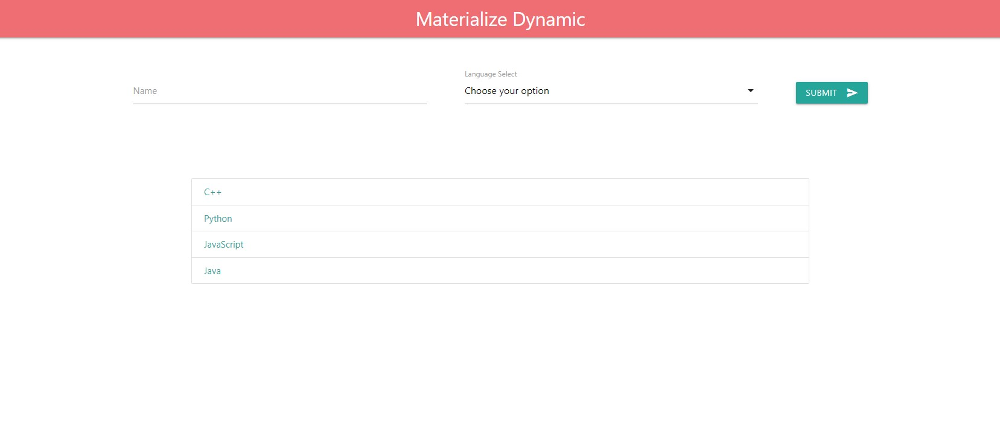
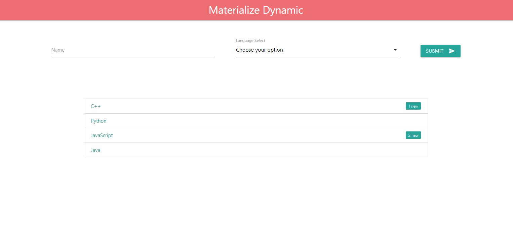

# Materialize Dynamic

This is a demo project which just demonstrates the working of `Materialize CSS` library. It also uses the `local storage` of the browser to store the temporary data.

# Sample Screens

### Default Screen

### Added 3 Elements

